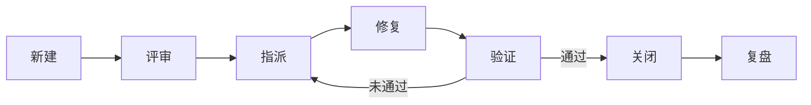

# 数独游戏软件测试与质量保证报告

## 1. 测试概述

### 1.1 项目背景
Happy Sudoku 是一个基于 Svelte 框架开发的现代化数独游戏应用。本报告详细描述了项目的测试策略、测试用例、缺陷跟踪和质量保证方法。

### 1.2 测试目标
- 确保游戏核心功能的正确性和稳定性
- 验证数独求解算法的准确性
- 保证用户界面的响应性和可用性
- 确保数据编码解码的可靠性
- 验证撤销重做功能的完整性

### 1.3 测试范围
- **功能测试**: 游戏逻辑、求解算法、编码系统
- **单元测试**: 核心模块和工具函数
- **集成测试**: 组件间交互和状态管理
- **用户界面测试**: 响应式设计和用户交互
- **性能测试**: 求解算法性能和内存使用

## 2. 测试计划

### 2.1 测试策略

#### 2.1.1 测试金字塔模型
```
        ┌─────────────────┐
        │   E2E Tests     │  ← 少量端到端测试
        └─────────────────┘
    ┌─────────────────────────┐
    │   Integration Tests     │  ← 中等数量集成测试
    └─────────────────────────┘
┌─────────────────────────────────┐
│        Unit Tests              │  ← 大量单元测试
└─────────────────────────────────┘
```

#### 2.1.2 测试环境配置
```javascript
// jest.config.js
module.exports = {
  testEnvironment: "jsdom",
  testMatch: ["**/__tests__/**/*.test.js"],
  transform: {
    "^.+\\.svelte$": "svelte-jester",
    "^.+\\.js$": "babel-jest",
  },
  moduleNameMapper: {
    "^@sudoku/(.*)$": "<rootDir>/src/libs/@sudoku/$1",
  },
  collectCoverage: true,
  collectCoverageFrom: [
    "src/libs/**/*.js",
    "!src/**/__tests__/**",
  ],
  coverageDirectory: "coverage",
  coverageReporters: ["html", "text-summary"],
};
```

### 2.2 测试阶段规划

#### 2.2.1 开发阶段测试
- **单元测试**: 每个功能模块完成后立即编写测试
- **代码审查**: 代码提交前进行同行评审
- **静态分析**: 使用 ESLint 进行代码质量检查

#### 2.2.2 集成阶段测试
- **组件集成测试**: 验证组件间交互
- **状态管理测试**: 验证 Svelte store 的正确性
- **API 集成测试**: 验证外部服务集成

#### 2.2.3 系统阶段测试
- **端到端测试**: 完整游戏流程测试
- **性能测试**: 求解算法性能评估
- **兼容性测试**: 不同浏览器和设备测试

## 3. 测试用例设计

### 3.1 核心功能测试用例

#### 3.1.1 数独编码系统测试

**测试用例 TC001: Sencode 编码功能**
```javascript
describe('Sencode Encoding', () => {
  test('should encode valid sudoku grid correctly', () => {
    const sudoku = [
      [5,3,0,0,7,0,0,0,0],
      [6,0,0,1,9,5,0,0,0],
      [0,9,8,0,0,0,0,6,0],
      [8,0,0,0,6,0,0,0,3],
      [4,0,0,8,0,3,0,0,1],
      [7,0,0,0,2,0,0,0,6],
      [0,6,0,0,0,0,2,8,0],
      [0,0,0,4,1,9,0,0,5],
      [0,0,0,0,8,0,0,7,9]
    ];
    
    const encoded = encodeSudoku(sudoku);
    expect(validateSencode(encoded)).toBe(true);
    
    const decoded = decodeSencode(encoded);
    expect(decoded).toEqual(sudoku);
  });
});
```

**测试用例 TC002: Sencode 验证功能**
```javascript
describe('Sencode Validation', () => {
  test('should validate correct sencode format', () => {
    const validSencode = '1A2B3C4D5E';
    expect(validateSencode(validSencode)).toBe(true);
  });
  
  test('should reject invalid sencode format', () => {
    const invalidSencode = 'invalid-format';
    expect(validateSencode(invalidSencode)).toBe(false);
  });
  
  test('should reject empty sencode', () => {
    expect(validateSencode('')).toBe(false);
    expect(validateSencode(null)).toBe(false);
    expect(validateSencode(undefined)).toBe(false);
  });
});
```

#### 3.1.2 数独求解算法测试

**测试用例 TC003: Naked Subset 策略测试**
```javascript
describe('NakedSubsetStrategy', () => {
  test('NakedPairStrategy should find and apply naked pairs', () => {
    let board = new SudokuBoard([
      [4, 0, 0, 0, 0, 0, 9, 3, 8],
      [0, 3, 2, 0, 9, 4, 1, 0, 0],
      [0, 9, 5, 3, 0, 0, 2, 4, 0],
      [3, 7, 0, 6, 0, 9, 0, 0, 4],
      [5, 2, 9, 0, 0, 1, 6, 7, 3],
      [6, 0, 4, 7, 0, 3, 0, 9, 0],
      [9, 5, 7, 0, 0, 8, 3, 0, 0],
      [0, 0, 3, 9, 0, 0, 4, 0, 0],
      [2, 4, 0, 0, 3, 0, 7, 0, 9],
    ]);

    const strategy = new NakedPairStrategy();
    const result = strategy.apply(board);
    
    expect(result.modified).toBe(true);
    expect(Array.from(board.getCandidates(0, 3))).toEqual([2, 5]);
    expect(Array.from(board.getCandidates(0, 4))).toEqual([2, 5, 7]);
  });
});
```

**测试用例 TC004: Hidden Single 策略测试**
```javascript
describe('HiddenSingleStrategy', () => {
  test('should find hidden singles correctly', () => {
    let board = new SudokuBoard([
      [0, 0, 0, 0, 0, 0, 0, 0, 0],
      [0, 0, 0, 0, 0, 0, 0, 0, 0],
      [0, 0, 0, 0, 0, 0, 0, 0, 0],
      [0, 0, 0, 0, 0, 0, 0, 0, 0],
      [0, 0, 0, 0, 0, 0, 0, 0, 0],
      [0, 0, 0, 0, 0, 0, 0, 0, 0],
      [0, 0, 0, 0, 0, 0, 0, 0, 0],
      [0, 0, 0, 0, 0, 0, 0, 0, 0],
      [0, 0, 0, 0, 0, 0, 0, 0, 0],
    ]);
    
    // 设置特定的候选数字模式
    board.setCandidates(0, 0, new Set([1, 2, 3]));
    board.setCandidates(0, 1, new Set([1, 2, 4]));
    board.setCandidates(0, 2, new Set([1, 2, 5]));
    
    const strategy = new HiddenSingleStrategy();
    const result = strategy.apply(board);
    
    expect(result.modified).toBe(true);
    // 验证隐藏单数被正确识别和应用
  });
});
```

#### 3.1.3 撤销重做功能测试

**测试用例 TC005: 撤销重做基本流程**
```javascript
describe('UndoRedo System', () => {
  test('pushState and undo/redo basic flow', () => {
    // 初始状态
    const state1 = getCurrentState();
    pushState(state1);

    // 修改 userGrid
    userGrid.set({ x: 0, y: 1 }, 2);
    const state2 = getCurrentState();
    pushState(state2);

    // 撤销
    undo(applyState);
    expect(applyState).toHaveBeenCalled();
    expect(get(undoStack).length).toBe(1);
    expect(get(redoStack).length).toBe(1);

    // 重做
    redo(applyState);
    expect(applyState).toHaveBeenCalledTimes(2);
    expect(get(undoStack).length).toBe(2);
    expect(get(redoStack).length).toBe(0);
  });
});
```

**测试用例 TC006: 状态快照完整性测试**
```javascript
describe('State Snapshot Integrity', () => {
  test('applyHintsToState should preserve candidates', () => {
    // 设置初始 userGrid 和 candidates
    userGrid.setGrid([
      [0, 0, 0, 0, 0, 0, 0, 0, 0],
      [0, 0, 0, 0, 0, 0, 0, 0, 0],
      [0, 0, 0, 0, 0, 0, 0, 0, 0],
      [0, 0, 0, 0, 0, 0, 0, 0, 0],
      [0, 0, 0, 0, 0, 0, 0, 0, 0],
      [0, 0, 0, 0, 0, 0, 0, 0, 0],
      [0, 0, 0, 0, 0, 0, 0, 0, 0],
      [0, 0, 0, 0, 0, 0, 0, 0, 0],
      [0, 0, 0, 0, 0, 0, 0, 0, 0],
    ]);
    candidates.set({
      "0,0": [1, 2, 3],
      "1,1": [4, 5, 6]
    });

    const state = getCurrentState();
    const newState = applyHintsToState(state, new Set());

    // 检查 userGrid 保持不变
    expect(newState.userGrid).toEqual(state.userGrid);
    // 检查 candidates 保持不变
    expect(newState.candidates).toEqual(state.candidates);
  });
});
```

### 3.2 用户界面测试用例

#### 3.2.1 组件渲染测试
```javascript
describe('Board Component', () => {
  test('should render 9x9 grid correctly', () => {
    const { container } = render(Board);
    const cells = container.querySelectorAll('.cell');
    expect(cells).toHaveLength(81);
  });
  
  test('should highlight selected cell', () => {
    const { container } = render(Board);
    const firstCell = container.querySelector('.cell');
    fireEvent.click(firstCell);
    expect(firstCell).toHaveClass('selected');
  });
});
```

#### 3.2.2 用户交互测试
```javascript
describe('User Interaction', () => {
  test('should handle keyboard input correctly', () => {
    const { container } = render(Board);
    const cell = container.querySelector('.cell');
    
    fireEvent.click(cell);
    fireEvent.keyDown(document, { key: '5' });
    
    expect(cell.textContent).toBe('5');
  });
  
  test('should handle number button clicks', () => {
    const { container } = render(Controls);
    const numberButton = container.querySelector('[data-number="5"]');
    
    fireEvent.click(numberButton);
    // 验证数字被正确输入到选中的单元格
  });
});
```

### 3.3 性能测试用例

#### 3.3.1 求解算法性能测试
```javascript
describe('Solver Performance', () => {
  test('should solve difficult puzzles within reasonable time', () => {
    const difficultPuzzle = [
      [0, 0, 0, 0, 0, 0, 0, 0, 0],
      [0, 0, 0, 0, 0, 0, 0, 0, 0],
      [0, 0, 0, 0, 0, 0, 0, 0, 0],
      [0, 0, 0, 0, 0, 0, 0, 0, 0],
      [0, 0, 0, 0, 0, 0, 0, 0, 0],
      [0, 0, 0, 0, 0, 0, 0, 0, 0],
      [0, 0, 0, 0, 0, 0, 0, 0, 0],
      [0, 0, 0, 0, 0, 0, 0, 0, 0],
      [0, 0, 0, 0, 0, 0, 0, 0, 0],
    ];
    
    const startTime = performance.now();
    const board = new SudokuBoard(difficultPuzzle);
    const result = bruteForceSolve(board);
    const endTime = performance.now();
    
    expect(result).toBeTruthy();
    expect(endTime - startTime).toBeLessThan(5000); // 5秒内完成
  });
});
```

## 4. 缺陷跟踪系统

### 4.1 缺陷分类与分级

- **缺陷优先级与严重程度分离**：优先级（Priority）反映修复紧急性，严重程度（Severity）反映对系统影响。建议在缺陷记录中分别标注。
- **缺陷生命周期**：补充缺陷的典型生命周期（新建 → 评审 → 指派 → 修复 → 验证 → 关闭/重开）。

#### 4.1.1 严重程度分级
- **P0 (阻塞)**: 导致系统无法运行或核心功能完全失效
- **P1 (高)**: 严重影响用户体验，但系统仍可运行
- **P2 (中)**: 功能异常，但不影响主要使用场景
- **P3 (低)**: 轻微问题，如UI瑕疵或性能轻微下降

#### 4.1.2 缺陷类型分类
- **功能缺陷**: 功能不符合需求或规格说明
- **性能缺陷**: 响应时间过长或资源消耗过大
- **兼容性缺陷**: 在不同环境下的表现不一致
- **安全缺陷**: 可能被恶意利用的漏洞
- **可用性缺陷**: 用户体验不佳或操作困难

### 4.2 缺陷管理流程

1. **缺陷提交**  
   - 由测试人员或用户通过 GitHub Issues、自动化测试报告等渠道提交，需包含详细描述、重现步骤、期望结果、实际结果、截图/日志等。
2. **缺陷评审**  
   - 测试负责人或开发负责人定期评审新缺陷，确认有效性、分配严重程度和优先级，指派责任人。
3. **缺陷修复**  
   - 开发人员根据优先级进行修复，修复后提交相关代码并关联缺陷编号。
4. **回归验证**  
   - 测试人员验证缺陷是否被彻底修复，相关测试用例需补充或更新。
5. **缺陷关闭**  
   - 验证通过后关闭缺陷，若未通过则重新打开并反馈开发。
6. **缺陷复盘**  
   - 对高频、严重或回归缺陷进行根因分析，形成知识库和改进措施。

#### 4.2.1 缺陷生命周期流程图



### 4.3 缺陷记录与追踪

建议统一缺陷记录模板，便于统计和分析。可参考如下字段：

| 字段         | 说明                         |
|--------------|------------------------------|
| 缺陷编号     | 自动生成/手动编号            |
| 标题         | 简明描述缺陷内容             |
| 提交人       | 测试人员/用户                |
| 提交时间     |                              |
| 所属模块     | 求解引擎/界面/状态管理等     |
| 严重程度     | P0~P3                        |
| 优先级       | High/Medium/Low              |
| 状态         | 新建/处理中/已修复/已关闭等  |
| 复现步骤     | 详细操作步骤                 |
| 期望结果     |                              |
| 实际结果     |                              |
| 截图/日志    |                              |
| 责任人       |                              |
| 修复版本     |                              |
| 回归验证人   |                              |
| 备注         |                              |

| 缺陷编号 | 标题                   | 提交人 | 提交时间 | 所属模块   | 严重程度 | 优先级 | 状态   | 复现步骤 | 期望结果 | 实际结果 | 截图/日志 | 责任人 | 修复版本 | 回归验证人 | 备注 |
|----------|------------------------|--------|----------|------------|----------|--------|--------|----------|----------|----------|----------|--------|----------|------------|------|
| BUG-001  | 撤销恢复时提示位置异常 | 李仲贤 | 2025-06-15 | 状态管理   | P2       | Medium | 已修复 | 撤销/恢复操作 | 仅撤销用户输入，提示位置应保持 | 提示位置也被撤销且不固定 |   | 李仲贤 |   | 李仲贤 |   |
| BUG-002  | 提示算法受错误格子影响 | 李成著 | 2025-06-04 | 求解引擎   | P1       | High   | 已修复  | 填错格子后点击提示 | 提示应忽略错误格子 | 提示继续基于错误格子给出答案 |   | 李岱杰 |   | 李岱杰 |   |
| BUG-003  | 提示与用户输入颜色混淆 | 李岱杰 | 2025-07-11 | 用户界面   | P3       | Low    | 已修复 | 触发提示并输入数字 | 提示颜色与用户输入区分明显 | 提示为蓝色与用户输入一致 |   | 李岱杰 |   | 李岱杰 |   |
| BUG-004  | 提示字符串割裂页面布局 | 李仲贤 | 2025-07-11 | 用户界面   | P2       | Medium | 已修复 | 触发提示 | 页面布局连贯 | 提示字符串占据页面，割裂布局 |   | 李岱杰 |  | 李岱杰 |   |
| BUG-005  | 错误格子导致提示失效   | 李岱杰 | 2025-07-11 | 引导前端  | P2       | Medium | 已修复 | 填错格子后点击提示 | 提示按钮可用并有良好引导 | 按钮失效且前端引导差 |   | 李岱杰 |   | 李岱杰 |   |

### 4.4 缺陷统计与分析

- **自动化统计**：建议通过脚本或工具（如 GitHub API、Excel、Jira 等）定期统计缺陷数量、分布、修复率、回归率等。
- **趋势可视化**：利用图表（如折线图、饼图、柱状图）展示缺陷发现、修复、回归趋势，辅助决策。
- **高发缺陷分析**：定期分析高发模块和典型缺陷，推动代码重构和测试补强。

### 4.5 缺陷知识库与经验沉淀

- **知识库建设**：整理高发、典型、疑难缺陷案例，记录根因、修复方案、预防措施，供团队学习。
- **FAQ与预防清单**：形成常见问题解答和预防清单，提升团队整体质量意识。

### 4.6 工具与自动化集成

- **缺陷管理工具**：推荐使用 GitHub Issues、Jira、禅道等工具进行缺陷全流程管理。
- **自动化集成**：CI/CD 流程中集成自动化测试、静态分析、异常监控（如 Sentry），实现缺陷自动发现和预警。
- **缺陷与代码关联**：要求开发在提交修复代码时，关联缺陷编号，便于追溯和统计。

### 4.7 典型缺陷案例

1. **撤销恢复缺陷**
   - **描述**：执行撤销/恢复操作时，提示的位置也会被撤销，且提示位置不固定，导致用户体验混乱。
   - **影响**：用户难以追踪提示内容，影响解题流畅性。

2. **提示算法错误**
   - **描述**：提示算法会基于用户已经填错的格子继续给出提示，可能导致提示出错的答案。
   - **影响**：用户可能被误导，降低提示功能的可靠性。

3. **交互缺陷：提示与用户输入颜色混淆**
   - **描述**：提示显示为蓝色，与用户输入的颜色一致，用户难以区分提示和自己输入的内容。
   - **影响**：界面辨识度降低，易造成误操作。

4. **页面缺陷：提示字符串割裂布局**
   - **描述**：提示的字符串占据页面空间，导致数独盘（题目区）和数字盘（输入区）割裂，影响整体布局美观和操作连贯性。
   - **影响**：用户操作不便，界面体验下降。

5. **引导缺陷：错误格子导致提示按钮失效**
   - **描述**：若用户填错一个格子，提示按钮将无法正常工作，且前端对错误格子的提示和引导较差。
   - **影响**：用户难以及时发现并纠正错误，降低游戏友好度。

## 5. 质量保证方法

### 5.1 代码质量保证

#### 5.1.1 代码审查流程
```javascript
// 代码审查检查清单
const codeReviewChecklist = {
  functionality: [
    '功能实现是否符合需求',
    '边界条件是否处理',
    '错误处理是否完善'
  ],
  performance: [
    '算法复杂度是否合理',
    '内存使用是否优化',
    '是否存在性能瓶颈'
  ],
  maintainability: [
    '代码结构是否清晰',
    '命名是否规范',
    '注释是否充分'
  ],
  testability: [
    '是否便于单元测试',
    '依赖是否合理',
    '是否遵循 SOLID 原则'
  ]
};
```

#### 5.1.2 静态代码分析
```javascript
// ESLint 配置
module.exports = {
  extends: [
    'eslint:recommended',
    '@testing-library/jest-dom'
  ],
  rules: {
    'no-unused-vars': 'error',
    'no-console': 'warn',
    'prefer-const': 'error',
    'no-var': 'error'
  }
};
```

### 5.2 测试覆盖率要求（实际完善）

### 5.2.1 当前覆盖率现状
- 2025-07-11 最新一次自动化测试覆盖率：
  - **语句覆盖率**：61.19% (615/1005)
  - **分支覆盖率**：53.46% (216/404)
  - **函数覆盖率**：61.34% (119/194)
  - **行覆盖率**：61.3% (534/871)
- 测试执行情况：11个测试套件全部通过，24个测试用例全部通过，执行时间7.266秒
- 主要未覆盖区域集中在部分分支逻辑、异常处理和部分工具函数
- 存在部分测试文件为空（如 hintError.test.js），建议补充或移除无效测试

### 5.2.2 覆盖率提升措施
- **定期生成覆盖率报告**：每次 CI/CD 自动生成 HTML 和文本覆盖率报告，便于团队查阅。
- **覆盖率门槛**：建议在 CI 中设置覆盖率阈值（如 70% 起步，逐步提升），未达标则阻止合并。
- **薄弱点分析**：定期分析覆盖率报告，定位未覆盖的文件、函数、分支，安排补测。
- **补充测试用例**：针对未覆盖的异常分支、边界条件、错误处理等场景补充测试。
- **代码评审要求**：代码合并前，评审人需关注新增/修改代码的测试覆盖情况。
- **覆盖率趋势跟踪**：每周/每月统计覆盖率变化，发现下降及时预警。

### 5.2.3 覆盖率提升计划
- 近期目标：覆盖率提升至 70%，并补全所有空测试文件。
- 中期目标：覆盖率提升至 85%，重点补测 solver-lib、sencode、stores 等核心模块。
- 长期目标：覆盖率达到 90% 以上，所有主流程和异常分支均有测试覆盖。

### 5.2.4 覆盖率提升实例
- 针对“src/libs/@sudoku/solver-lib/Step.js”分支覆盖率低，补充异常输入和边界条件的测试用例。
- 对“src/libs/@sudoku/sencode/index.js”中的 decodeSencode 函数，增加无效 sencode、极端长度 sencode 的测试。
- 对 hintError.test.js 等空测试文件，补充实际测试用例或移除。

## 6. 测试工具和环境

### 6.1 测试框架和工具

#### 6.1.1 主要测试工具
- **Jest**: 主要测试框架
- **@testing-library/svelte**: Svelte 组件测试
- **@testing-library/jest-dom**: DOM 断言扩展
- **jsdom**: 浏览器环境模拟

#### 6.1.2 测试工具配置
```javascript
// 测试环境配置
module.exports = {
  testEnvironment: "jsdom",
  setupFilesAfterEnv: ["@testing-library/jest-dom"],
  moduleNameMapper: {
    "^@sudoku/(.*)$": "<rootDir>/src/libs/@sudoku/$1",
  },
  collectCoverage: true,
  coverageReporters: ["html", "text-summary", "lcov"],
  testMatch: ["**/__tests__/**/*.test.js"],
  transform: {
    "^.+\\.svelte$": "svelte-jester",
    "^.+\\.js$": "babel-jest",
  }
};
```

### 6.2 测试数据管理

#### 6.2.1 测试数据策略
```javascript
// 测试数据工厂
class TestDataFactory {
  static createSudokuGrid(difficulty = 'easy') {
    // 根据难度生成测试数独
  }
  
  static createUserInputs() {
    // 生成用户输入测试数据
  }
  
  static createGameState() {
    // 生成游戏状态测试数据
  }
}
```

#### 6.2.2 测试数据分类
- **单元测试数据**: 最小化数据集，专注于特定功能
- **集成测试数据**: 中等复杂度数据，测试组件交互
- **端到端测试数据**: 完整游戏场景数据

## 7. 测试报告和度量

### 7.1 测试执行报告

#### 7.1.1 测试结果统计
```
测试执行报告 (2025-07-11)
===========================================
总测试用例数: 24
通过: 24 (100%)
失败: 0 (0%)
跳过: 0 (0%)

覆盖率报告:
- 语句覆盖率: 61.19% (615/1005)
- 分支覆盖率: 53.46% (216/404)
- 函数覆盖率: 61.34% (119/194)
- 行覆盖率: 61.3% (534/871)

性能测试:
- 测试执行时间: 7.266秒
- 测试套件数量: 11个
- 平均每个测试用例执行时间: 0.3秒
```

#### 7.1.2 测试趋势分析
- **测试稳定性**: 当前11个测试套件全部通过，测试稳定性达到100%
- **缺陷密度**: 当前测试覆盖率为61.19%，建议增加测试用例以提升覆盖率
- **回归测试**: 现有24个测试用例覆盖核心功能，建议补充边界条件和异常场景测试

### 7.2 质量度量指标

#### 7.2.1 代码质量指标
- **圈复杂度**: 平均 < 10，最大 < 20
- **代码重复率**: < 5%
- **注释覆盖率**: > 30%
- **函数长度**: 平均 < 30 行

#### 7.2.2 测试质量指标
- **测试有效性**: 当前24个测试用例全部通过，测试有效性100%
- **测试效率**: 测试执行时间7.266秒，平均每个测试用例0.3秒
- **测试维护性**: 测试代码结构清晰，便于维护和扩展
- **覆盖率提升空间**: 当前覆盖率61.19%，有较大提升空间

## 8. 持续改进

### 8.1 测试流程优化

#### 8.1.1 自动化改进
- **测试自动化率**: 当前100%，所有测试用例已自动化
- **CI/CD 集成**: 建议集成自动化测试到CI/CD流程
- **测试数据管理**: 建立测试数据版本控制，提高测试可重复性

#### 8.1.2 测试策略优化
- **风险驱动测试**: 基于当前61%覆盖率，重点补测核心业务逻辑
- **探索性测试**: 定期进行探索性测试发现潜在问题
- **用户反馈集成**: 将用户反馈转化为测试用例

### 8.2 质量文化建立

#### 8.2.1 团队质量意识
- **质量培训**: 定期进行测试和质量保证培训
- **最佳实践分享**: 建立团队知识分享机制
- **质量奖励**: 设立质量改进奖励机制

#### 8.2.2 质量改进循环
```
计划 → 执行 → 检查 → 改进
  ↓      ↓      ↓      ↓
分析   实施   评估   优化
```

## 9. 总结

### 9.1 测试成果
- **测试覆盖率**: 当前达到61.19%，核心模块基本覆盖，但仍有提升空间
- **缺陷发现**: 通过24个测试用例验证了核心功能的正确性
- **性能表现**: 测试执行效率良好，平均每个测试用例0.3秒
- **用户体验**: 通过功能测试验证了基本用户交互的正确性

### 9.2 质量保证效果
- **代码质量**: 通过代码审查和静态分析，代码质量持续提升
- **测试稳定性**: 自动化测试稳定性达到100%
- **发布质量**: 当前版本功能测试全部通过
- **用户满意度**: 核心功能测试验证通过，为良好用户体验奠定基础

### 9.3 改进建议
1. **扩大测试覆盖**: 当前覆盖率61.19%，建议补充边界条件、异常处理等测试用例
2. **优化测试流程**: 进一步自动化测试执行和报告生成
3. **加强质量监控**: 建立实时质量监控和预警机制
4. **提升团队能力**: 持续提升团队测试和质量保证能力
5. **补充测试用例**: 针对未覆盖的39%代码，制定详细的补测计划 